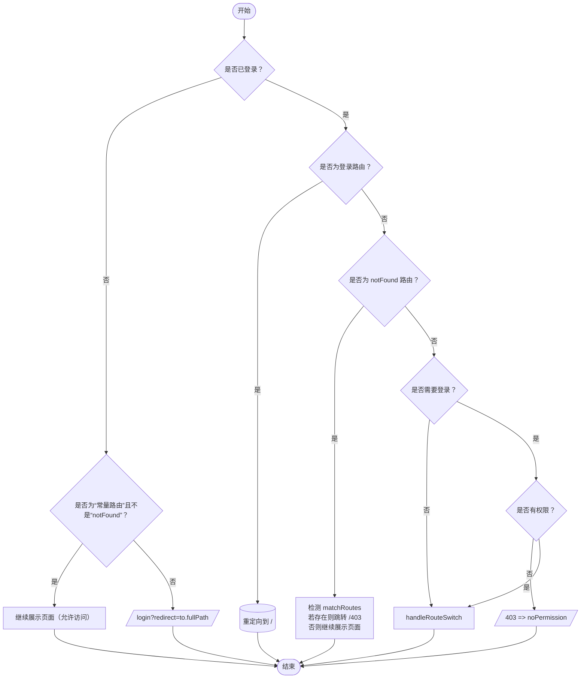

## 路由守卫逻辑流程图

下面是一个使用 **Mermaid** 绘制的流程图，描述了 `createRouteGuard` 函数的逻辑走向。根据**登录状态**、**是否是固定路由**、**是否有角色权限**、以及**是否为 `404/notFound` 路由**等条件，决定要跳转到哪个路径（或保持在原有页面）：

### 图解说明

1. **登录判断**
   如果用户**未登录**：
   - 如果路由是固定常量路由（且不是 `notFound`），则允许继续访问（返回 `null`）。
   - 否则，跳转到登录页，并附带重定向参数。
2. **已登录**：
   - 如果当前路由是登录页，则自动跳转到首页。
   - 如果是 `notFound`，再根据匹配情况决定跳转到 `403` 还是返回 `null`。
   - 如果路由不需要登录 (`to.handle.constant`)，直接调用 `handleRouteSwitch` 检查是否需要外链跳转（`href`）。
   - 如果路由需要登录，则检测用户是否拥有该路由要求的角色，若无权限则重定向 `403`，否则继续调用 `handleRouteSwitch`。
3. **handleRouteSwitch**
   - 若 `handle.href` 存在，则打开外链并导航回之前的页面。
   - 若无，则返回 `null` 表示继续在当前页面内渲染。

> 整个流程在 `RootLayout` 组件中执行，若返回字符串或对象，即 `<Navigate>` 到目标地址；否则渲染子路由 `<Outlet>`。

这样一套路由守卫能有效地在客户端根据用户状态做相应权限校验和登录跳转，提升应用的安全性与灵活性。
